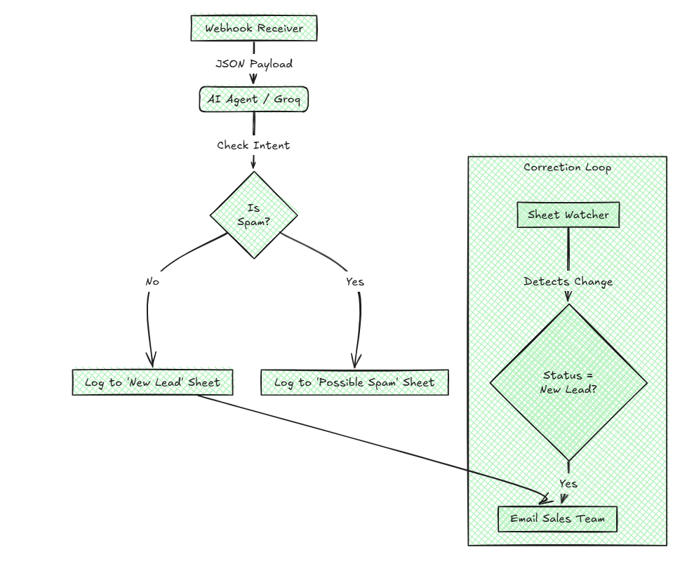

#### Automation Workflow: Implementation Guide

**The Problem:** Capturing data is only half the battle. If we forward every single form submission to the sales team, we bury them in noise. Spam bots, solicitors, and junk submissions waste valuable time. Conversely, if we filter too aggressively using simple keyword blocking (e.g., blocking "crypto"), we risk deleting legitimate high-value customers. We need a system that filters noise without blocking real business opportunities.

**First Principles Design:** We applied the principle of **Quality Gating**. In any manufacturing process, you filter out defects *before* packaging, not after. Similarly, this workflow acts as a "bouncer" at the door. It judges the quality of the lead immediately upon arrival. By separating the "Ingestion" (receiving data) from the "Notification" (alerting humans), we ensure that the sales team is only interrupted when there is a verified opportunity that requires their attention.

**The Approach:** This solution functions as an intelligent digital mailroom that runs two processes in parallel:

#### The Filter (Happy vs. Sad Flows)

* **The Judge:** Instead of using rigid lists of banned words, we use an AI model (running on Groq) to read the message. It determines if the intent is a valid business inquiry or spam.
* **The Sad Flow:** If the lead is spam, it is quietly filed into a "Possible Spam" archive in Google Sheets. No email is sent, and the sales team is not disturbed.
* **The Happy Flow:** If the lead is valid, it is logged as a "New Lead" and an email alert is sent immediately to the sales representative.

**The Spam Criteria:**
We instructed the AI to flag a lead as "Spam" if it matches any of these patterns:

* **Solicitation:** The user is trying to sell *us* something (e.g., SEO services, web design, outsourcing).
* **Gibberish:** The message contains random characters or nonsensical text.
* **Disposable Identity:** The name contains a URL (e.g., `www.pharmacy.com`) or the email is from a known burner domain.

#### The Safety Net (Correction Loop)

* Automation is not perfect. If the AI makes a mistake and marks a real person as spam, the client can simply change the status in the Google Sheet from "Possible Spam" to "New Lead."
* The workflow watches the sheet for these manual changes. When it detects a correction, it "resurrects" the lead and sends the email alert, ensuring no customer is ever lost.

---

---

#### Implementation Guide

**Step 1: Import the Workflow**
Open your n8n dashboard. Create a new workflow, select "Import from File," and upload the `gushwork-workflow.json` file included in this package.

**Step 2: Connect Your Accounts**
You will need to configure credentials for three nodes:

* **Google Sheets:** Connect your Google account and select the spreadsheet where you want to store leads.
* **Groq (AI):** Paste your API Key into the HTTP Request / AI Agent node.
* **Email:** Configure your SMTP server (Gmail, Outlook, or SendGrid) to allow the system to send alerts.

**Step 3: The Logic Map (Node Explanations)**
Refer to this guide to understand what each step in the diagram does:

* **Webhook Receiver:** *Receives the data.* This node waits for the form to be submitted on the website. When the data arrives, it starts the workflow.
* **AI Agent Group:** *Checks the quality.* These nodes read the name, email, and message. They decide if the submission is a real request or just junk based on the text.
* **Route Traffic:** *Sorts the leads.* This acts like a switch. If the lead is junk, it sends it to the spam list. If it is real, it sends it to the sales team.
* **Google Sheets Nodes:** *Saves the record.* These nodes write every submission into a spreadsheet. This keeps a permanent list of both spam and real leads for future review.
* **Notify Sales Team:** *Sends the email.* This sends the customer's details to the salesperson. It only runs for real leads.
* **Sheet Watcher:** *Fixes mistakes.* This checks the spreadsheet every minute. If a human manually changes a lead from "Spam" to "Real," it detects the change and triggers the email.

---

#### Technical Decision Log: AI Model Selection

**1. The Infrastructure: Why Groq?**
I selected Groq as the inference engine primarily for **speed**.
In lead generation, waiting matters. Standard tools often take 3-5 seconds to "think" before responding. Groq’s specialized hardware processes data in milliseconds. This ensures that the lead is checked, filtered, and routed to the sales team instantly, making the workflow feel real-time.

**2. The Model: Why OpenAI GPT-OSS-120B?**
I chose the `openai/gpt-oss-120b` model over smaller, simpler options for three specific reasons:

* **Understanding Nuance:** This is a massive, intelligent model. Unlike smaller AI that just looks for "bad words," this model understands context. It can tell the difference between a real customer asking *about* "crypto payments" (valid) and a bot trying to *sell* "crypto schemes" (spam).
* **Safety First:** In sales, blocking a real customer costs money. This larger model makes fewer mistakes than smaller ones, ensuring I only block leads when there is a very high certainty of spam.
* **Reliability:** This model is designed to follow complex instructions perfectly. It adheres strictly to the formatting rules I set, whereas smaller models often break the data structure, causing the automation to fail.